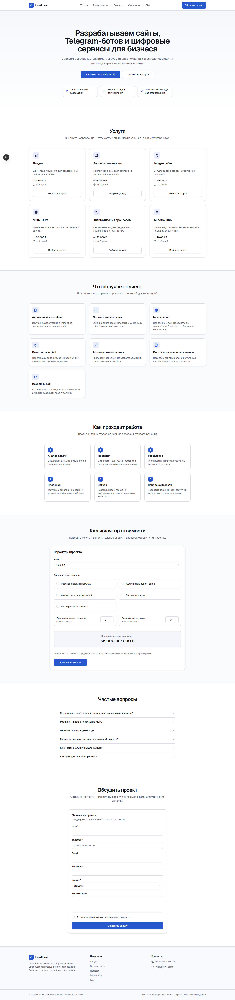

# LeadFlow

Демонстрационный портфельный MVP корпоративного сайта digital-компании: каталог услуг, калькулятор предварительной стоимости, приём заявок с сохранением в Supabase и уведомлением менеджера в Telegram, закрытая административная панель.

> ⚠️ Это учебный/портфельный проект. Юридические страницы демонстрационные, оплата и часть бизнес-процессов не реализованы — подробности в разделе [«Известные ограничения»](#известные-ограничения).




## Содержание

- [Бизнес-задача](#бизнес-задача)
- [Реализованные функции](#реализованные-функции)
- [Технологический стек](#технологический-стек)
- [Архитектура](#архитектура)
- [Структура проекта](#структура-проекта)
- [Локальный запуск](#локальный-запуск)
- [Настройка Supabase](#настройка-supabase)
- [Применение SQL-миграций](#применение-sql-миграций)
- [Создание администратора](#создание-администратора)
- [Настройка Telegram-бота](#настройка-telegram-бота)
- [Переменные окружения](#переменные-окружения)
- [Запуск в режиме разработки](#запуск-в-режиме-разработки)
- [Тестирование](#тестирование)
- [Production build](#production-build)
- [Деплой на Vercel](#деплой-на-vercel)
- [Известные ограничения](#известные-ограничения)
- [Возможные улучшения](#возможные-улучшения)

## Бизнес-задача

Малому и среднему бизнесу нужны сайты, Telegram-боты, внутренние кабинеты, мини-CRM и автоматизация процессов, но сложно оценить бюджет и не потерять заявку. LeadFlow — сайт-визитка digital-студии, который презентует услуги, даёт посетителю предварительный расчёт стоимости и гарантированно доводит заявку до менеджера: с валидацией на сервере, сохранением в базе и уведомлением в Telegram.

## Реализованные функции

- Адаптивный лендинг: услуги, преимущества, этапы работы, FAQ (проверено на 360/768/1024/1440 px).
- Калькулятор стоимости с мгновенным пересчётом диапазона на клиенте.
- Форма заявки (React Hook Form + Zod) с honeypot- и time-based защитой от спама.
- Серверный маршрут `POST /api/leads`: повторная валидация, нормализация телефона, **пересчёт цены на сервере** (клиентским значениям не доверяем), атомарная генерация номера заявки в базе, сохранение в Supabase.
- Уведомление менеджера в Telegram; сбой Telegram не приводит к потере уже сохранённой заявки.
- Страница успешной отправки с номером заявки и диапазоном стоимости.
- Административная панель на Supabase Auth: дашборд, поиск/фильтры/пагинация по заявкам, карточка заявки с изменением статуса.
- Row Level Security на всех таблицах; проверка роли `admin` без рекурсивных RLS-политик.
- SEO-метаданные, `robots.txt`, `sitemap.xml`.
- 7 e2e-тестов на Playwright (расчёт + отправка заявки, ошибки формы, защита `/admin`, валидация формы входа).

## Технологический стек

| Категория | Технологии |
|---|---|
| Фреймворк | Next.js (App Router), React, TypeScript (strict) |
| Стили/UI | Tailwind CSS v4, компоненты в стиле shadcn/ui, Lucide Icons |
| Формы/валидация | React Hook Form, Zod |
| Данные | Supabase PostgreSQL, Supabase Auth, `@supabase/ssr` |
| Уведомления | Telegram Bot API |
| Тесты | Playwright (e2e), ESLint, `tsc --noEmit` |
| Деплой | Vercel |

Пакет `shadcn/ui` **не устанавливался через свою CLI** — в окружении разработки хост `ui.shadcn.com` недоступен по сетевой политике. Вместо этого примитивы (`components/ui/*`) собраны вручную по тем же принципам (Radix UI + `class-variance-authority` + Tailwind), включая `components.json`, так что при наличии доступа `npx shadcn add <component>` продолжит работать штатно.

## Архитектура

```text
Пользователь
    ↓
Next.js-интерфейс (лендинг, калькулятор — React state, без обращений к БД)
    ↓
POST /api/leads
    ↓
Серверная валидация Zod + honeypot/time-check + пересчёт цены
    ↓
Supabase PostgreSQL (service-role, минуя RLS)
    ↓
Telegram Bot API (best-effort, ошибка не теряет заявку)
    ↓
Уведомление менеджеру
```

```text
Администратор
    ↓
Supabase Auth (email + пароль, без публичной регистрации)
    ↓
proxy.ts обновляет cookie сессии → requireAdmin() проверяет сессию и роль
    ↓
Закрытая панель (RLS дополнительно проверяет is_admin() на каждый запрос)
    ↓
Чтение и изменение заявок (обновление статуса — через server action)
```

Ключевые архитектурные решения:

- Публичная форма никогда не пишет в базу напрямую — только через `POST /api/leads`, который использует `SUPABASE_SERVICE_ROLE_KEY` (серверный модуль `lib/supabase/admin.ts`, помечен `import "server-only"`).
- Сервер не доверяет диапазону цены от клиента: `lib/pricing/calculate-price.ts` — единственный источник истины, вызывается и в браузере (для мгновенного UI), и в API-маршруте (для авторитетного пересчёта).
- Каталог услуг и цены живут в `lib/pricing/pricing-config.ts` (один массив, без дублирования по компонентам) и зеркалируются в `supabase/seed.sql`; поэтому главная страница полностью статична и не зависит от доступности Supabase.
- Публичный номер заявки (`LF-2026-0001`) генерируется атомарно в базе (`generate_lead_number()`), а не через `COUNT(*)`.
- Роль администратора проверяется через таблицу `profiles`, а RLS-рекурсия исключена SQL-функцией `is_admin()` с `SECURITY DEFINER`.

## Структура проекта

```text
app/
  page.tsx                  — главная страница
  layout.tsx, globals.css   — корневой layout, тема Tailwind
  privacy/, consent/        — демонстрационные юридические страницы
  success/                  — страница успешной отправки заявки
  admin/
    login/                  — вход (без публичной регистрации)
    page.tsx                — дашборд
    leads/page.tsx           — таблица заявок
    leads/[id]/page.tsx       — карточка заявки
  api/leads/route.ts        — POST /api/leads
components/
  layout/                   — header, footer, общий каркас страницы
  landing/                  — секции лендинга, калькулятор, форма заявки
  admin/                    — дашборд, таблица, карточка, статус
  ui/                       — базовые примитивы (в духе shadcn/ui)
lib/
  supabase/                 — client.ts / server.ts / admin.ts / middleware.ts
  validation/lead.ts        — общая Zod-схема формы и API
  pricing/                  — конфигурация услуг/опций и расчёт цены
  telegram/                 — отправка уведомлений
  auth/require-admin.ts     — серверная проверка сессии и роли
  actions/leads.ts          — server action обновления статуса
  utils/                    — env, телефон, валюта, дата, статусы, ошибки
types/database.ts           — типы таблиц Supabase
supabase/
  migrations/                — SQL-миграции (enum, таблицы, RLS, функции)
  seed.sql                   — начальные данные по услугам
  make_admin.sql              — шаблон назначения роли admin
tests/e2e/                   — Playwright-тесты
proxy.ts                     — обновление сессии Supabase (Next.js 16 Proxy)
.env.example
```

## Локальный запуск

Требования: Node.js 20+, аккаунт Supabase, Telegram-бот (для уведомлений).

```bash
git clone <repo-url>
cd LeadFlow
npm install
cp .env.example .env.local   # заполните значениями из разделов ниже
npm run dev
```

Откройте http://localhost:3000.

## Настройка Supabase

1. Создайте проект на [supabase.com](https://supabase.com).
2. В **Project Settings → API** скопируйте `Project URL`, `anon public` ключ и `service_role` ключ (секретный, только на сервер).
3. Заполните ими `.env.local` (см. [переменные окружения](#переменные-окружения)).

## Применение SQL-миграций

Файлы лежат в `supabase/migrations/` в порядке применения (`0001` → `0004`).

**Вариант A — через Supabase CLI:**

```bash
npx supabase login
npx supabase link --project-ref <your-project-ref>
npx supabase db push
```

**Вариант B — вручную:** откройте **SQL Editor** в Supabase Dashboard и выполните содержимое файлов по порядку: `0001_init.sql`, `0002_lead_numbering.sql`, `0003_admin_check.sql`, `0004_rls.sql`, затем `supabase/seed.sql` (шесть услуг: `landing`, `corporate-site`, `telegram-bot`, `mini-crm`, `automation`, `ai-assistant`).

## Создание администратора

Публичной регистрации в проекте нет — администратора создаём вручную:

1. **Authentication → Users → Add user** в Supabase Dashboard — задайте email и пароль.
2. В **SQL Editor** выполните запрос из `supabase/make_admin.sql`, подставив email:

   ```sql
   insert into profiles (id, full_name, role)
   select id, 'Администратор LeadFlow', 'admin'
   from auth.users
   where email = 'admin@example.com'
   on conflict (id) do update set role = 'admin';
   ```

3. Войдите на `/admin/login` тем же email и паролем.

Пароль администратора нигде не хранится в репозитории.

## Настройка Telegram-бота

1. Создайте бота через [@BotFather](https://t.me/BotFather), получите `TELEGRAM_BOT_TOKEN`.
2. Узнайте `chat_id`, куда слать уведомления (личный чат, группа или канал, где бот состоит участником) — например, через `https://api.telegram.org/bot<token>/getUpdates` после отправки боту любого сообщения.
3. Заполните `TELEGRAM_BOT_TOKEN` и `TELEGRAM_CHAT_ID` в `.env.local`.

Сообщения отправляются в обычном текстовом режиме (без `parse_mode`), поэтому пользовательский ввод физически не может сломать разметку Telegram.

## Переменные окружения

См. `.env.example`. Секреты (`SUPABASE_SERVICE_ROLE_KEY`, `TELEGRAM_BOT_TOKEN`, `TELEGRAM_CHAT_ID`) не имеют префикса `NEXT_PUBLIC_` и используются только в серверном коде. При отсутствии обязательной переменной приложение выбрасывает понятную ошибку (`lib/utils/env.ts`), а не падает с неясным исключением.

```text
NEXT_PUBLIC_SITE_URL=
NEXT_PUBLIC_SUPABASE_URL=
NEXT_PUBLIC_SUPABASE_ANON_KEY=
SUPABASE_SERVICE_ROLE_KEY=
TELEGRAM_BOT_TOKEN=
TELEGRAM_CHAT_ID=
```

## Запуск в режиме разработки

```bash
npm run dev
```

## Тестирование

```bash
npm run lint         # ESLint
npm run typecheck    # tsc --noEmit
npm run test:e2e      # Playwright (нужен npm run dev / собранный сайт на localhost:3000 — поднимается автоматически)
```

Тест `tests/e2e/public-lead-flow.spec.ts` мокает ответ `POST /api/leads`, поэтому весь набор проходит **без реального Supabase/Telegram**. Тесты `admin-auth.spec.ts` и `admin-lead-management.spec.ts` проверяют защиту `/admin` и валидацию формы входа — тоже без реального бэкенда. Полный ручной сценарий (вход администратора, изменение статуса, появление заявки в базе, уведомление в Telegram) требует настоящий Supabase-проект и Telegram-бота — см. разделы выше.

Ручные проверки перед релизом (раздел «Финальный критерий приёмки» в ТЗ) выполнялись в браузере (Playwright, вручную из агента): калькулятор пересчитывает диапазон мгновенно и без перезагрузки, форма блокирует некорректные данные и показывает ошибки рядом с полями, `/admin/*` корректно перенаправляет неавторизованных пользователей, интерфейс не даёт горизонтальной прокрутки на 360/768/1024/1440 px.

## Production build

```bash
npm run build
npm run start
```

## Деплой на Vercel

1. Импортируйте репозиторий в Vercel.
2. Добавьте переменные окружения из `.env.example` в **Project Settings → Environment Variables** (для Production и Preview).
3. `NEXT_PUBLIC_SITE_URL` укажите как реальный домен деплоя.
4. Запустите деплой — команда сборки по умолчанию (`next build`) не требует изменений.
5. Примените SQL-миграции к продакшн-проекту Supabase (см. выше) и назначьте администратора до первого входа в `/admin`.

## Известные ограничения

Проект — демонстрационный портфельный MVP. Сознательно не реализовано:

- Калькулятор даёт **предварительную**, а не окончательную оценку.
- Нет полноценной CRM, назначения ответственных менеджеров и истории изменения статуса заявки.
- Нет пользовательской регистрации (только один способ создания администратора — вручную).
- Нет внешней аналитики (в код заложено место для последующего подключения).
- Нет промышленного rate limiting — только honeypot и проверка времени заполнения формы.
- Юридические страницы (`/privacy`, `/consent`) демонстрационные и требуют юридической проверки перед реальным коммерческим использованием.
- Telegram используется только для одностороннего уведомления, без обратной связи.
- Нет email-рассылки и онлайн-оплаты.

## Возможные улучшения

- Email-уведомления дополнительно к Telegram.
- История работы с заявкой и заметки менеджера.
- Назначение ответственного менеджера, экспорт заявок в CSV.
- UTM-метки и аналитика источников трафика.
- Интеграция с внешней CRM и календарём.
- Промышленный rate limiting и CAPTCHA.
- Мультиязычный интерфейс, тёмная тема.
